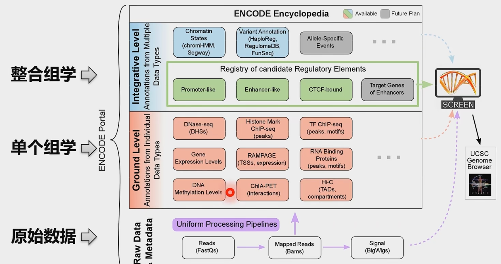
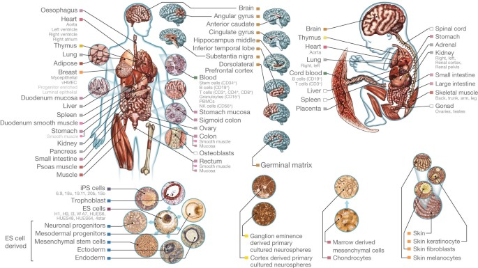
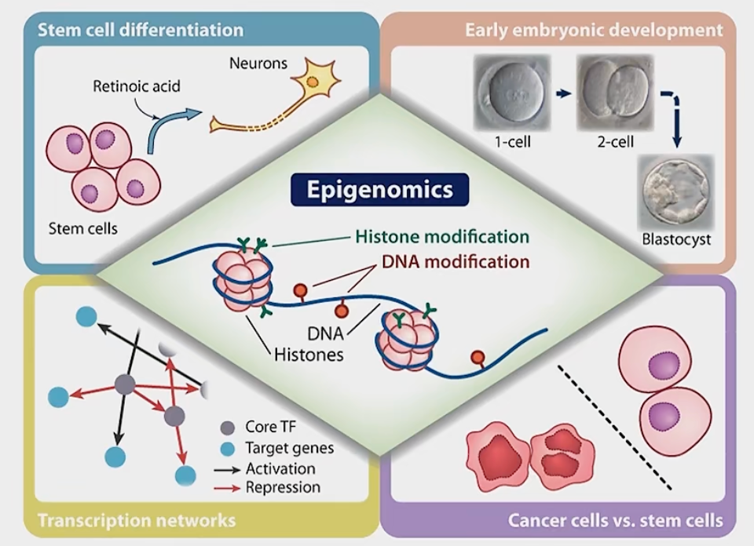
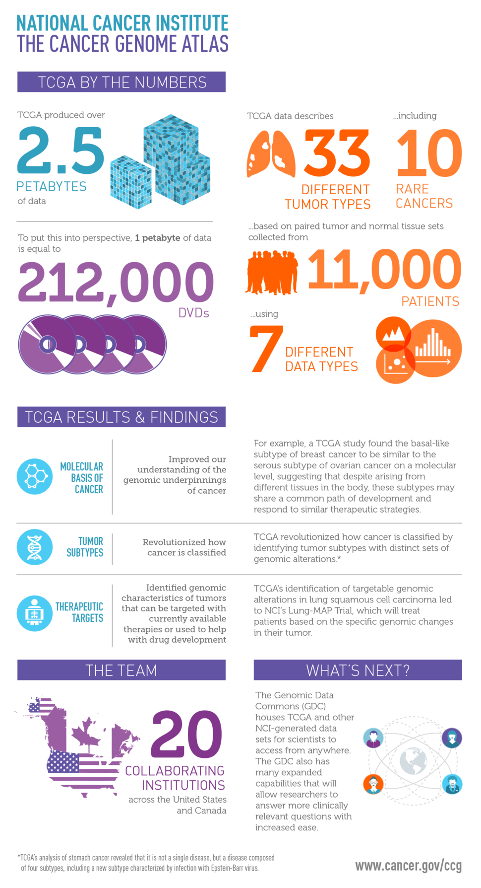
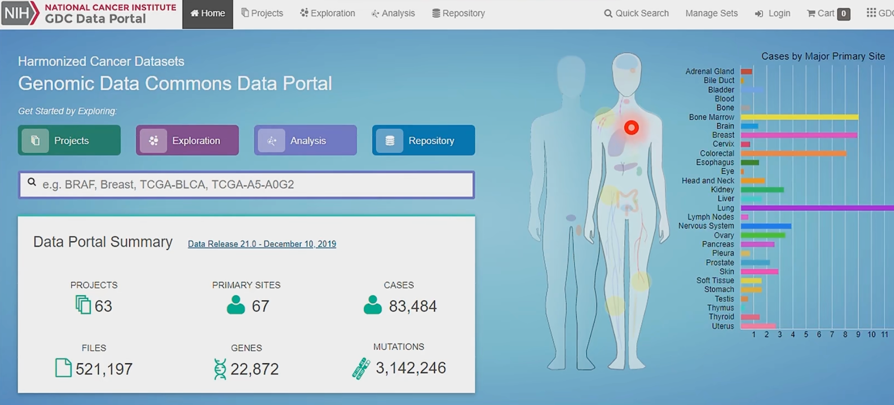
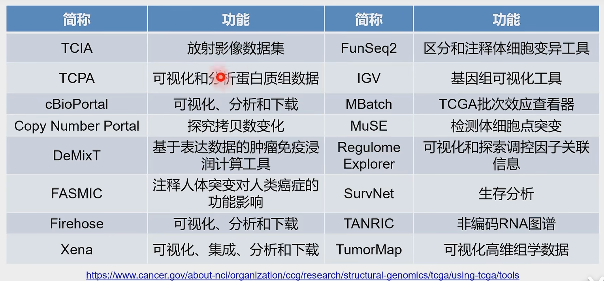

## 基因组到精准组

**Genomics:** It's the operating manual containing all the instructions that helped you develop from a single cell into the person you are today. It guides your growth, helps your organs to do their jobs, and repairs itself when it becomes damaged. And it's unique to you. The more you know about your genome and how it works, the more you'll understand your own health and make informed health decisions. 

[Encode数据库](https://www.encodeproject.org/)

原始数据 -> 单组学 -> 多组学集成

**ENCODE**: 坚定出的功能元件包含组蛋白修饰, DNA甲基化等方面的内容. (Start in 2003)

- A comprehensive resource to allow the scientific community to better understand how the genome can affect **human health**, and to stimulate the development of **new therapies to prevent and treat these disease.**

**Roadmap**: 表观遗传组学蓝图计划 (start in 2008)

- A public resource of human epigenomic data to catalyze basic biology and disease-oriented research.
- 建立一套人类参考表观遗传组, 为表观遗传对人类发育, 生命过程/衰老, 对环境反应, 疾病的病理过程提供资源
- 探讨不同种类的细胞间, 同一种类不同个体细胞间表观基因组的差异
- [Integrative analysis of 111 reference human epigenomes](https://www.nature.com/articles/nature14248):  integrative analysis of 111 reference human epigenomes generated as part of the programme, profiled for histone modification patterns, DNA accessibility, DNA methylation and RNA expression. 
- [IHEC Data](epigenomesportal.ca/ihec)

**Epigenomics**: 在DNA序列不发生改变的情况下, 通过基因组多个层次的**化学修饰**和**空间结构变化**, 影响基因功能且可以跨代遗传的分支研究领域.

**[TCGA](https://www.cancer.gov/ccg/research/genome-sequencing/tcga)**: The Cancer Genomics Altas, a landmark cancer genomics program, molecularly characterized over 20k primariy cancer and matched normal samples spanning 33 cancer types. It generated over 2.5 PB of genomics, epigenetic, transcriptomic, and proteomic data.

| TCGA Intro                                                   | Cancer  Type                                                 | [GDC Dataset](portal.gdc.cancer.gov)                         |
| ------------------------------------------------------------ | ------------------------------------------------------------ | ------------------------------------------------------------ |
|  |  |  High-quality datasets spanning cases from cancer genomic studies such as `The Cancer Genomic Atlas(TCGA), Human Cancer MOdels Initiative (HCMI), Foundation Medicine Inc.(FMI), and Clinical Proteomic Tumor Analysis Consortium (CPTAC)` |

> TCGA 相关网站和工具

