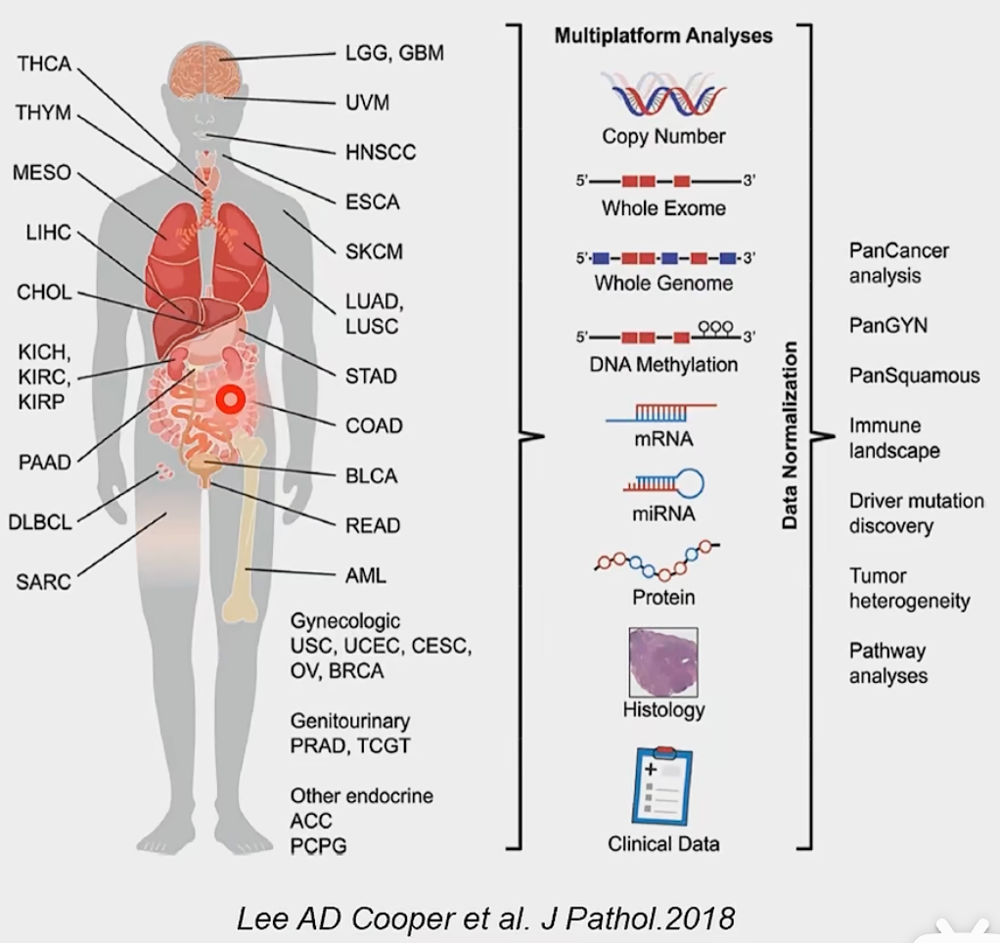

## 基因组到精准组

**Genomics:** It's the operating manual containing all the instructions that helped you develop from a single cell into the person you are today. It guides your growth, helps your organs to do their jobs, and repairs itself when it becomes damaged. And it's unique to you. The more you know about your genome and how it works, the more you'll understand your own health and make informed health decisions. 

[Encode数据库](https://www.encodeproject.org/)

原始数据 -> 单组学 -> 多组学集成

**ENCODE**: 坚定出的功能元件包含组蛋白修饰, DNA甲基化等方面的内容. (Start in 2003)

- A comprehensive resource to allow the scientific community to better understand how the genome can affect **human health**, and to stimulate the development of **new therapies to prevent and treat these disease.**

**Roadmap**: 表观遗传组学蓝图计划 (start in 2008)

- A public resource of human epigenomic data to catalyze basic biology and disease-oriented research.
- 建立一套人类参考表观遗传组, 为表观遗传对人类发育, 生命过程/衰老, 对环境反应, 疾病的病理过程提供资源
- 探讨不同种类的细胞间, 同一种类不同个体细胞间表观基因组的差异
- [Integrative analysis of 111 reference human epigenomes](https://www.nature.com/articles/nature14248):  integrative analysis of 111 reference human epigenomes generated as part of the programme, profiled for histone modification patterns, DNA accessibility, DNA methylation and RNA expression. 
- [IHEC Data](epigenomesportal.ca/ihec)

**Epigenomics**: 在DNA序列不发生改变的情况下, 通过基因组多个层次的**化学修饰**和**空间结构变化**, 影响基因功能且可以跨代遗传的分支研究领域.

**[TCGA](https://www.cancer.gov/ccg/research/genome-sequencing/tcga)**: The Cancer Genomics Altas, a landmark cancer genomics program, molecularly characterized over 20k primariy cancer and matched normal samples spanning 33 cancer types. It generated over 2.5 PB of genomics, epigenetic, transcriptomic, and proteomic data.

| TCGA Intro                                                   | Cancer  Type                                                 | [GDC Dataset](portal.gdc.cancer.gov)                         |
| ------------------------------------------------------------ | ------------------------------------------------------------ | ------------------------------------------------------------ |
|  |  |  High-quality datasets spanning cases from cancer genomic studies such as `The Cancer Genomic Atlas(TCGA), Human Cancer MOdels Initiative (HCMI), Foundation Medicine Inc.(FMI), and Clinical Proteomic Tumor Analysis Consortium (CPTAC)` |

> TCGA 相关网站和工具

**[精准医学](https://medlineplus.gov/genetics/)**: 以基因组, 生物信息学, 数据科学等多学科交叉融合而发展建立**新型医学模式**, 通过系统整合个体的**组学数据, 临床信息, 生活方式和环境因素,** 构建人类疾病**多层次复杂知识网络和疾病分类新方法**, 即使人类疾病发生发展的分子机制.

- 研究对象: 从疾病到个体.
- 研究范畴: 从患病人群到健康人群.
- All ofUs 

- [Genomic data in the All ofUs Research Program](https://www.nature.com/articles/s41586-023-06957-x): the programmes genomics data release of **245k clinical-grade genome sequences**. This resource is unique in its diversity as 77% of participants are from communities that are historically under-represented in biomedical research and 46% are individuals from under-represented racial and ethnic minorities... more than 1 B genetic variants, including more than 275M previously unreported genetic variants.

**[UK Biobank](https://www.ukbiobank.ac.uk/)**: The data showcase provides a summary of all the information gathered by UK Biobank on our 500k participants and is available to explore. Note only does this contain background information on how these data were collected, it also includes notes about future collections.

- 研究遗传因素, 环境因素, 生活习惯与人类重大疾病的关联.
- [Population genetic consideration for using biobanks as international resources in the pandemic ara and beyond.](https://bmcgenomics.biomedcentral.com/articles/10.1186/s12864-021-07618-x)

### Further Reading

- Genomic data in the All of Us Research program. Nature. 2024
- Cell-of-Origin Patterns Dominate the Molecular Classification of 10k Tumors from 33 Types of Cancer. Cell. 2008
- Towards precision medicine. Nature Reviews Genetics. 2016
- A global reference for human genetic variation. Nature. 2015
- Integrative analysis of 111 reference human epigenomes. Nature. 2015
- Integrating common and rare genetic variation in diverse human populations. Nature. 2010

## 基因组图谱与测序

**基因组遗传图谱**

- 人在非编码区域序列的占比最高.

- DNA 测序技术发展: Gel-based sequencing -> Capillary sequencing -> single-molecule sequencing(SMRT)
- 人类基因组计划的主要成果:
    - 遗传图谱: 连锁图谱(linkage map), 某一物种的染色体图谱, 显示所知的基因和/或遗传标记的相对位置. 
        - 图距: 以多肽的遗传标记作为界标, 计算细胞减数分裂过程中遗传标记之间发生重组的频率, 以确定两个遗传标记在染色体上的相对位置
        - 当两个遗传标记之间的重组值为1%时, 图距为1 cM
        - 图谱构建需要可以鉴别的标记(marker), 含基因标记和DNA标记. 
            - 基因标记: 利用表型性状基因, 根据连锁交换原理来分析基因之间的连锁关系和遗传距离
            - DNA标记: 
                - 限制片段长度多态: 扩增片段长度多态, 随机扩增多态性DNA
                - 微卫星标记: 短串连重复序列(STR), 简单重复序列
                - 单核苷酸多态
    - 物理图谱: 是DNA中一些可识别的标记(如限制性酶切位点, 基因等), 在DNA上的物理位置, 以DNA实际长度即bp, kp, Mb为图距的基因组图谱. (图距是物理长度单位, 如染色体的带区, 核苷酸对的数量.)
    - 转录组图谱: 利用EST作为标记所构建的分子遗传图谱
    - 序列图谱: 通过基因组测序得到的, 以A, T, G, C为标记单位的基因组DNA序列.

**基因组物理图谱**

**DNA测序技术**

**基因组测序策略**

**单细胞测序**
