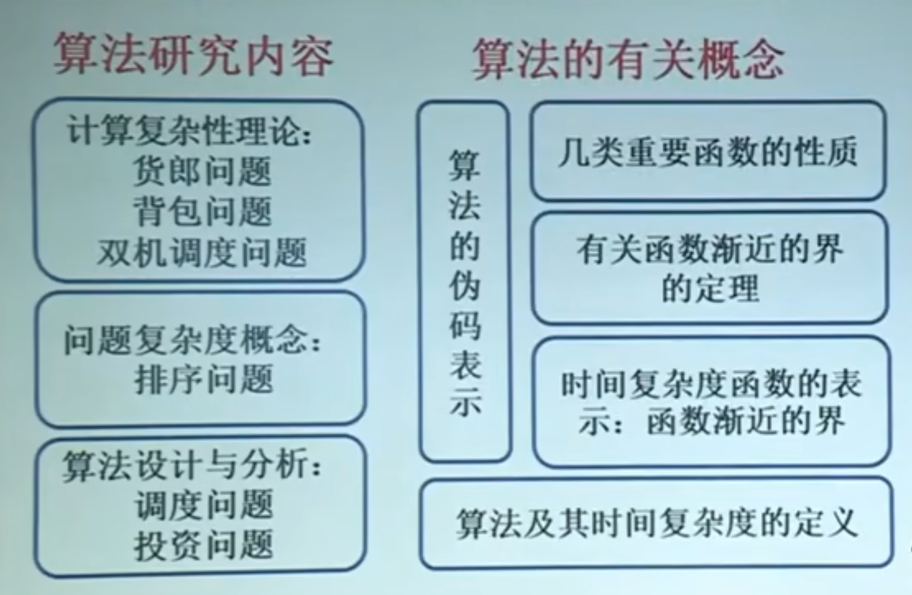
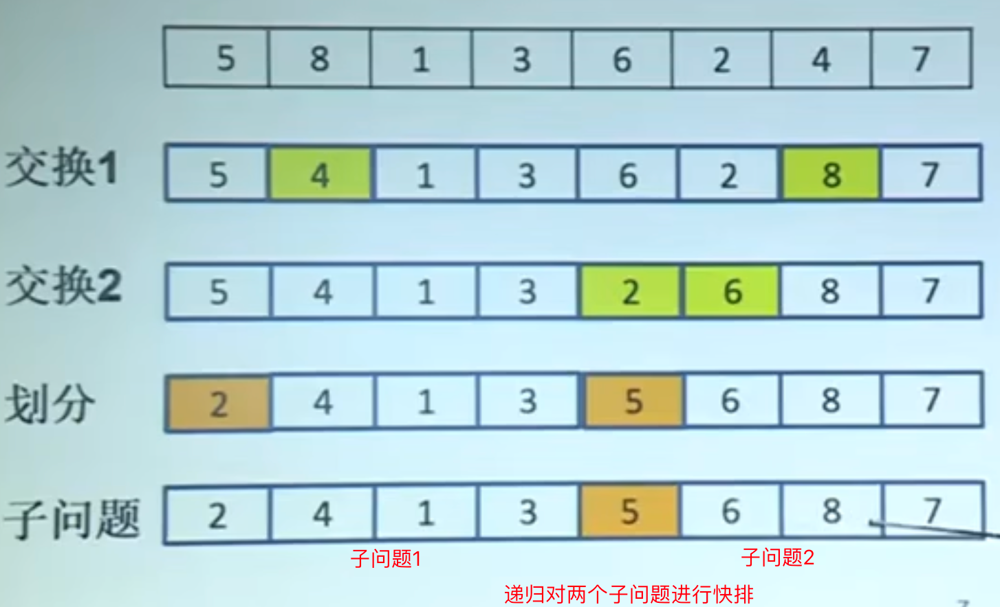
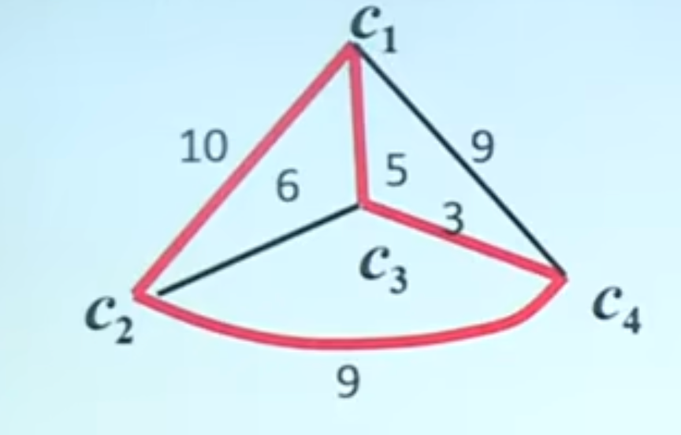
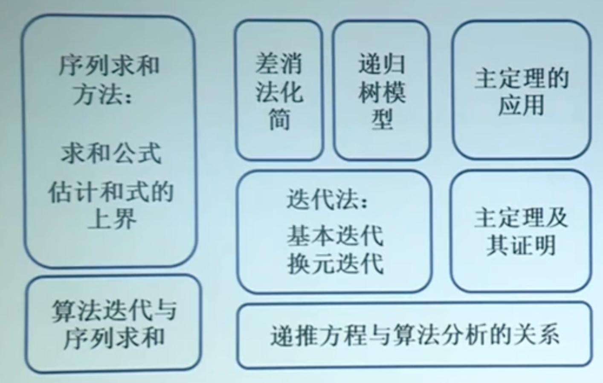
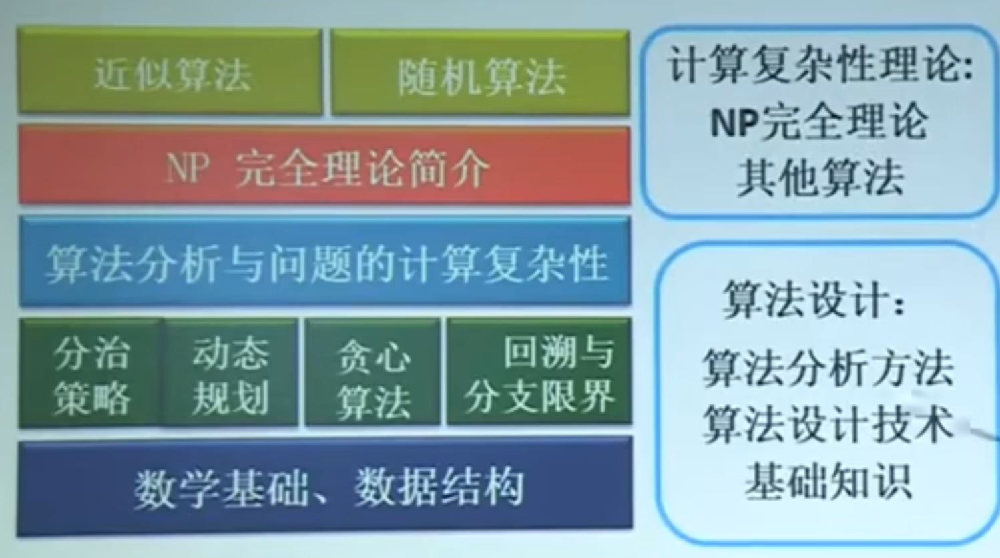

# 算法设计例子



###  **调度问题**: 

有n项任务, 每项任务加工时间已知. 从0时刻开始陆续安排到一台机器上加工. 每个任务的完成时间是从0时刻到任务加工截止的时间. 求总完成时间(所有任务完成时间之和)最短的安排方案.

- 输入: 任务集, $S={1,2,...,n}$ , 第j项任务加工时间: $t_j \in Z, j=1,2,...,n$
- 输出, 调度$I$ , $S$ 的排列 $i_1, i_2,...,i_n$
- 目标函数: $I$ 的完成时间, $t(I)=\sum_{k=1}^n (n-k+1)t_{i_k}$
- 解: $t(I^*)=min \{t(I)|I为S的排列 \}$

**贪心算法**:

- 设计策略: 加工时间短的先做
- 算法: 根据加工时间从小到大排序, 依次加工
- 算法正确性: 对所有输入实例都得到最优解

证: 假设调度$f$ 第 $i,j$ 项任务相邻切有逆序, 即 $t_i > t_j$ . 交换任务 $i,j$ 得到调度g

总完成时间 $t(g)-t(f)=t_j-t_i<0$

#### 背包

有4件物品要装入背包, 物品中量和价值如下:

| 标号      | 1    | 2    | 3    | 4    |
| --------- | ---- | ---- | ---- | ---- |
| 重量$w_i$ | 3    | 4    | 4    | 2    |
| 价值$v_i$ | 7    | 9    | 9    | 2    |

背包重量限制是6, 文如何选择物品, 使得不超重的情况下装入背包的物品价值达到最大?

思想: 单位重量价值优先装.


### 投资问题

问题: $m$ 元, 投资$n$ 个项目. 效益函数 $f_i(x)$ , 表示第 $i$ 个项目投 $x$ 元的效益, $i=1,2,...,n$ . 求如何分配每个项目的钱数使得总效益最大?

| x    | F1(x) | F2(x) | F3(x) | F4(x) |
| ---- | ----- | ----- | ----- | ----- |
| 0    | 0     | 0     | 0     | 0     |
| 1    | 11    | 0     | 2     | 2     |
| 2    | 12    | 5     | 10    | 21    |
| 3    | 13    | 10    | 30    | 22    |
| 4    | 14    | 15    | 32    | 23    |
| 5    | 15    | 20    | 40    | 24    |

- 输入: $n, m f_i(x), i=1,2,..,n, x=1,2,...,m$ 
- 解: $n$ 维向量 $<x_1,x_2,...,x_n>, x_i$ 是第 $i$ 个项目的钱数, 使得下述条件满足:

$$
max \sum_{i=1}^n f_i(x_i) \\
\sum_{i=1}^n x_i=m, x\in  N
$$

**蛮力算法**

- 对有所满足下述条件的向量 $<x_1,x_2,...x_n>$ 

- $$
    x_1+x_2+...+x_n=m\\
    x_i为非负整数, i = 1,2,...,n
    $$

- 计算相应的效益 : $ f_1(x_1)+f_2(x_2)+...+f_n(x_n)$ , 从中确认效益最大的向量

**蛮力算法效率**:

- 方程 $x_1+x_2+...+x_n=m$ 的非负整数解 $<x_1,x_2,...,x_n>$ 的个数估计:
- 可行解表示成 0-1序列: $m$ 个1, $n-1$ 个0

```markdown
若n=4, m=7
可行解: <1,2,3,1>
序列: 1 0 1 1 0 1 1 1 0 1
```

- 序列个数是输入规模的指数函数

$$
C(m+n-1, m) \\
=\frac{(m+n-1)!}{m!n(m-1)!}\\
= \Omega((1 + \epsilon)^{m+n-1})
$$


### 排序问题: 问题的复杂度

  

| 算法         | 最坏情况     | 平均情况     |
| ------------ | ------------ | ------------ |
| 插入排序     | $O(n^2)$     | $O(n^2)$     |
| 冒泡排序     | $O(n^2)$     | $O(n^2)$     |
| 快速排序     | $O(n^2)$     | $O(n log n)$ |
| 堆排序       | $O(n log n)$ | $O(n log n)$ |
| 二分归并排序 | $O(n log n)$ | $O(n log n)$ |

**插入排序**: 类似于整理扑克牌, 逐步将一个新元素插入到已排序的序列中, 使其保持有序

- 步骤:
    - 从第2个元素开始(假设第一个元素已排序)
    - 将当前元素与前面的已排序部份比较, 找到合适位置插入
    - 重复知道所有元素都被插入
- 时间复杂度:
    - 最好情况: $O(n)$ : 输入已排序, 只需比较无需移动
    - 平均情况: $O(n^2)$ : 需要比较和移动元素
    - 最好情况: $O(n^2)$ : 输入逆序, 每次都需移动所有前面的元素
- 空间复杂度: $O(1)$ : 原地排序
- 特点: 适合小规模数据或部份有序数据

**冒泡排序**: 通过相邻元素的两两比较, 将较大的元素逐步“冒泡”的数组的一端

- 步骤:
    - 从数组开头比较相邻元素, 如果前者大于后者, 则交换
    - 一轮结束后, 最大元素到达末尾
    - 对剩余元素重复, 直到没有交换发生
- 时间复杂度:
    - **最好情况**: O(n) - 已排序，只需一轮比较。
    - **平均情况**: O(n²) - 需要多轮比较和交换。
    - **最坏情况**: O(n²) - 逆序，交换次数最多。

- **空间复杂度**: O(1) - 原地排序。
- **特点**: 简单但效率低，适合教学。

**快速排序**: 通过选择一个“基准 (pivot)”, 将数组分为两部份, 小于基准的在一侧, 大于基准的在另一侧, 然后递归处理子数组



- 步骤
    - 选择一个基准（通常选首元素、尾元素或随机元素）
    - 分区：调整数组使得基准左侧都小于它，右侧都大于它。
    - 对左右子数组递归执行上述步骤。
- **时间复杂度**:
    - **最好情况**: O(n log n) - 每次分区均匀。
    - **平均情况**: O(n log n) - 随机基准下接近均匀分区。
    - **最坏情况**: O(n²) - 输入已排序或逆序且基准选择不当（如始终选首元素）。
- **空间复杂度**: O(log n) - 递归调用栈的深度。
- **特点**: 高效，广泛应用于实际场景。

**归并排序**: 采用分支法, 将数组分成两半, 分别排序后再合并

- 步骤:
    - 将数组递归分成两部分, 直到每个子数组只有一个元素
    - 合并: 将两个有序子数组合成一个有序数组
    - 重复直到整个数组有序.
- **时间复杂度**:
    - **最好情况**: O(n log n) - 无论输入如何，分治和合并的步骤固定。
    - **平均情况**: O(n log n)。
    - **最坏情况**: O(n log n)。
- **空间复杂度**: O(n) - 需要额外的数组存储合并结果。
- **特点**: 稳定排序，适合大数据集。


### 货朗问题与计算复杂性理论

**问题**: 有n个城市, 已知任两个城市之间的距离. 求一条每个城市恰好经过1次的回路, 使得总长度最小.



- 输入: 有穷个城市的集合 $C=\{ c_1,c_2,...,c_n \}$ , 距离 $d(c_i,c_j)=d(c_j,c_i)\in Z^+, 1 \leq i \leq j \leq n$
- 解: $1,2,...,n$ 的排列 $k_1,k_2,...,k_n$ 使得:

$$
min \{\sum_{i=1}^{n-1} d(c_{k_i}, c_{k_i+1}) + d(c_{k_n}, c_{k_1}) \}
$$

## 算法及其时间复杂度

平均时间复杂度 $A(n)$ : 设 $S$ 是规模为n的实例集, 实例 $I \in S$ 的概率是 $P_I$ , 算法对实例 $I$ 执行的基本运算次数是 $t_I$ 
$$
A(n) = \sum_{I \in S} P_I t_i
$$
输入实例的概率分布:

假设 $x$ 在L中概率是 $p$ , 且每个位置概率相等, 若不在L中, 则需要比较n次.
$$
A(n) = \sum_{i=1}^n i \frac{p}{n} + (1-p)n \\
=\frac{p(n+1)}{2} + (1-p)n
$$


**伪码**

```shell
赋值: <-
分支: if ... then ... [else]
循环: while, for, repeat until
转向: goto
输出: return
调用: 直接用写过程的名字
注释: //
```

**求最大公约数**

- 算法 Euclid(m,n)
- 输入: 非负整数 $m,n$ , 其中 $m, n$ 不全为0
- 输出: $m,n$ 的最大公约数

```shell
while m > 0 do:
  r <- n mod m
  n <- m
  m < -r
return n
```

### 函数的渐进界

$o$ : 设$f$ 和 $g$ 是定义域为自然数集 $N$ 上的函数. 若对于任意整数 $c$ 都存在 $n_0$ , 使得对一切 $n > n_0$ 则有: $0 \le f(n) \le c g(n)$ 成立, 则记作

$f(n)=o(g(n))$

理解: $f(n)=o(g(n))$ 表示$f(n)$ 的增长速度在n趋于无穷大时, 比 $g(n)$ 慢的多.

example:
$$
f(n)=n^2+n\\
f(n)=o(n^3)\\
c \geq 显然成立, 因为 n^2+n<cn^3
$$


#### 5种算法的复杂度表示符号

$O$ (Big-O Notation) : 表示函数的上界, 描述最坏情况下的复杂度

-  公式: $f(n) = O(g(n)), 存在常数c>0和n_0, 使得对所有n \geq n_0, 有 f(n)\le c*g(n)$
- explanation: 描述算法最坏的情况, 相当于"你最远需要跑多远"

$\Omega$ (Big-Omega Notation): 表示函数的下界, 描述最好情况下的复杂度

- Formulate: $f(n)=\Omega (g(n)), 表存在常数c>0和n_0, 使得对所有n \geq n_0, 有 f(n) \geq c*g(n)$ 
- Explantion: 描述算法最好的情况, 相当于"你至少需要跑多远"

$\Theta$ (Big theta): 表示函数的紧确界, 描述平均情况下的复杂度

- Formulate: $f(n)=\Theta (g(n)) 表示存在常数c1,c2>0和n_0, 使得对所有n\geq n_0, 有c_1*g(n)\le f(n)<c2*g(n)$
- Explantion: 描述算法的平均情况, 相当于"你跑步的时间正好在这个范围"

$o$ (Little-o): 表示算法的上界, 但比$O$ 更严格

- $f(n)=o(g(n))$ 表示对于任意常数 $c>0$，存在 $n_0$，使得对所有 $n≥n0$，有 $f(n)<c⋅g(n)$

- Explantion: 描述算法的上界, 但比$O$ 更严格, 相当于"你跑步的时间远远少于某个值"

$\omega$ (Little-omega Notation): 表示函数的下界, 但比大 $\Omega$ 更严格.

- Explantion: 跑步的时间比某个下限还要大得多.

**定理**: 设函数 $f,g,h$ 的定义域为自然数集合, 则函数的阶之间的关系具有传递性

- 如果 $f=O(g), g=O(h), 则f=O(h)$
- 若$f=\Omega, g=\Omega , 则 f=\Omega(h)$ 

**stringline**: $n!=(2\pi n)^{1/2} (\frac{n}{e})^n(1+\Theta(1/n))$

- $n! = o(n^n)$
- n!=$\omega(2^n)$
- $log(n!)=\Theta (nlog n)$

**小结**

-  对数函数的阶<幂函数的阶, 多项式函数的阶<指数函数的阶
- 算法的时间复杂度是各步操作时间之和, 在常数步的情况下取最高阶数即可.

## 数学基础


$$
等差: \sum_{k=1}^n a_k = \frac{n(a_1+a_n)}{2} \\
等比: \sum_{k-0}^n aq^k=\frac{a(1-q^{n+1})}{1-q}, \sum_{k=0}^\infty aq^k = \frac{a}{1-q}, (q<1)\\
调和级数: \sum_{k=1}^n \frac{1}{k}=\ln n + O(1)
$$


##  算法设计



1. 问题建模: 对于输入参数和解给出形式化或半形式化的描述
2. 设计算法:
    1. 选择什么算法?
    2. 如何描述这个方法?
    3. 正确性--是否对所有的实例都得到正确的解
    4. 这个方法是否对所有实例都得到最优解?如何证明
    5. 如果不是, 能否找到反例

3. 分析算法- 效率

Al gorithm + Data Structure = programming 

- 好的算法:
    - 提高求解问题的效率
    - 节省存储空间

- 算法的研究目标

    - 问题: 建模并寻找算法
    - 算法: 算法的评价
    - 算法类: 问题复杂度估计
    - 问题类: 能够求解的边界

    

$$

$$

